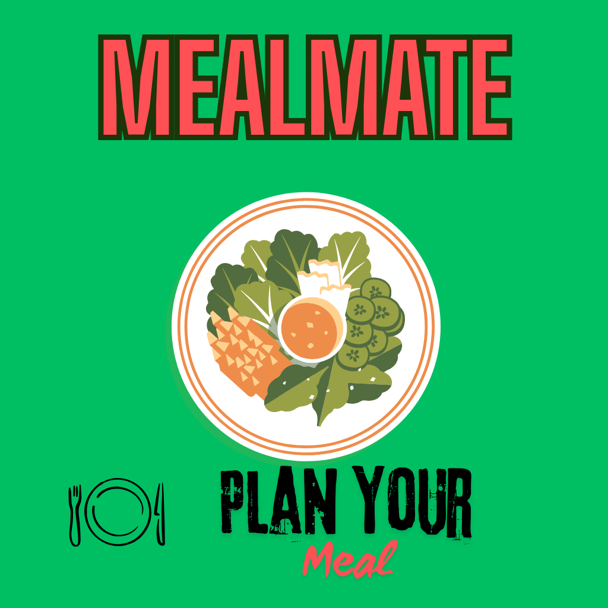

# 🍽️ Meal Mate - Complete Meal Planning & Management App



## 📱 Overview

**Meal Mate** is a comprehensive React Native mobile application built with Expo that helps users plan, manage, and organize their meals efficiently. The app combines meal creation,### **Notification Settings**

- **Meal Type Controls**: Individual notification toggles for each meal type
- **Custom Reminder Times**: Personalized notification scheduling for breakfast, lunch, dinner, and snacks
- **Meal Planning Reminders**: Option to enable daily reminders to plan meals in advance
- **Test Notifications**: Built-in test functionality to verify notification delivery
- **Permission Management**: Automatic handling of notification permissions
- **Real-time Updates**: Instant settings synchronization across the app
- **Persistent Storage**: Settings automatically saved and restoredg, favorites management, and advanced camera functionality with QR code scanning capabilities.

---

## 🚀 Key Features

### 🔐 **Authentication System**

- **User Registration**: Create account with email and password
- **Secure Login**: Firebase Authentication integration
- **Profile Management**: Complete user profile with photo upload
- **Session Persistence**: Automatic login state management
- **Logout Functionality**: Secure session termination

### 🍽️ **Meal Management**

- **Create Meals**: Add detailed meal information with rich metadata
- **Edit Meals**: Update existing meal details and images
- **Delete Meals**: Remove meals with confirmation dialogs
- **View Meals**: Browse all created meals in organized layout
- **Real-time Sync**: Live updates across all devices

### 📊 **Meal Details**

- **Basic Information**: Title, name, description
- **Nutritional Data**: Calories, servings, cooking time
- **Ingredients**: Comma-separated ingredient lists
- **Categories**: Breakfast, lunch, dinner, snack classification
- **Images**: High-quality meal photography with cloud storage
- **Metadata**: Creation dates, user association, favorites status

### 📅 **Meal Planning System**

- **Weekly Calendar**: Interactive 7-day meal planning interface
- **Date Selection**: Plan meals for any future date
- **Meal Type Organization**: Separate breakfast, lunch, dinner, snack sections
- **Drag & Drop Planning**: Select from existing meals to plan
- **Confirmation Dialogs**: Verify meal planning actions
- **Visual Indicators**: Show planned vs. empty meal slots

### ❤️ **Favorites Management**

- **Toggle Favorites**: One-tap favorite/unfavorite meals
- **Real-time Updates**: Instant favorites synchronization using Firestore listeners
- **Dedicated Favorites Screen**: Browse all favorite meals
- **Visual Indicators**: Heart icons showing favorite status
- **Persistent Storage**: Favorites saved across sessions

### 📸 **Advanced Camera System**

- **Photo Capture**: High-quality meal photography
- **Front/Back Camera**: Toggle between camera modes
- **Gallery Integration**: Select existing photos from device
- **Auto-save to Gallery**: Photos automatically saved to device
- **Direct Integration**: Camera photos flow into meal creation
- **Permission Management**: Proper camera and media permissions

### 📱 **QR Code Scanner**

- **Real-time Scanning**: Instant QR code detection
- **Visual Feedback**: Scanning frame with corner indicators
- **URL Detection**: Automatic web URL identification and opening
- **Error Handling**: Graceful handling of invalid QR codes
- **Mode Switching**: Toggle between camera and scanner modes

### 🔔 **Smart Notification System**

- **Scheduled Meal Reminders**: Automatic notifications for planned meals
- **Custom Notification Times**: Set personalized reminder times for each meal type
- **Meal Type Controls**: Individual settings for breakfast, lunch, dinner, and snack notifications
- **Meal Planning Reminders**: Daily reminders to plan meals in advance
- **Permission Management**: Proper notification permission handling for Android/iOS
- **Test Notifications**: Built-in functionality to test notification delivery
- **Persistent Settings**: Notification preferences saved using AsyncStorage
- **Real-time Scheduling**: Automatic notification scheduling when meals are planned
- **Smart Cleanup**: Automatic removal of notifications when meals are deleted or rescheduled

### 🎨 **Theme System**

- **Dark/Light Mode**: Complete theme switching
- **System Integration**: Follow device theme preferences
- **Persistent Settings**: Theme choice saved using AsyncStorage
- **Comprehensive Colors**: Full color palette for all UI elements
- **Real-time Switching**: Instant theme changes without app restart

### 👤 **User Profile Management**

- **Profile Creation**: Complete user profile setup during registration
- **Profile Editing**: Update display name, email, profile image
- **Image Upload**: Profile photo management with Cloudinary
- **Account Settings**: Comprehensive user account management
- **Data Persistence**: Profile data stored in Firestore

### 🏠 **Dashboard & Navigation**

- **Home Screen**: Quick overview with recent meals and statistics
- **Bottom Tab Navigation**: Easy access to all major sections
- **Quick Actions**: Fast access to common tasks
- **Statistics Display**: Meal counts, planning overview
- **Recent Activity**: Latest meals and planning activities

---

### **Screenshots**

<details>
<summary><b>📱 Authentication Screens</b> (Click to expand)</summary>

#### Registration

<p align="center">
  
  
</p>
</details>

<details>
<summary><b>🏠 Home & Dashboard</b> (Click to expand)</summary>

#### Home Screen

<p align="center">
  
  
</p>
<p align="center">
  
  
</p>
<p align="center">
  
</p>
</details>

<details>
<summary><b>🍽️ Meals & Favorites</b> (Click to expand)</summary>

#### Meals Screen

<p align="center">
  
</p>

#### Favorites Page

<p align="center">
  
</p>
</details>

<details>
<summary><b>📅 Meal Planner</b> (Click to expand)</summary>

#### Meal Planning Calendar

<p align="center">
  
  
</p>
</details>

<details>
<summary><b>🔄 QR Code Generator</b> (Click to expand)</summary>

#### QR Code Generation & Sharing

<p align="center">
  
  
</p>
<p align="center">
  
</p>
</details>

<details>
<summary><b>⚙️ Settings & Profile</b> (Click to expand)</summary>

#### Settings Screens

<p align="center">
  
  
</p>
<p align="center">
  
</p>

#### Notification Settings

<p align="center">
  
  
</p>

#### Profile Management

<p align="center">
  
  
</p>
</details>

### **Github Repo Link**
https://github.com/Himanthajaga/Meal-Mate.git

### **Youtube Demo Link**
https://youtu.be/GHPtuMilwSc?si=twRUEDScC8Nflg7l

### **APK Expo-Link**
https://expo.dev/artifacts/eas/pahaYAgghbYADxDwmcUduL.apk

### **Deployment URL**
 https://meal-mate--x6g2g1f659.expo.app

## 🛠️ Technical Implementation

### **Frontend Architecture**

- **Framework**: React Native with Expo SDK 54
- **Language**: TypeScript for type safety
- **Navigation**: Expo Router with file-based routing
- **Styling**: NativeWind (Tailwind CSS) + inline styles
- **Icons**: Material Icons from @expo/vector-icons
- **State Management**: React Context API with hooks

### **Backend & Database**

- **Database**: Firebase Firestore (NoSQL)
- **Authentication**: Firebase Authentication
- **Real-time Updates**: Firestore onSnapshot listeners
- **Image Storage**: Cloudinary cloud storage
- **Data Structure**: Optimized collections with proper indexing

### **Key Technologies**

```json
{
  "expo": "~54.0.7",
  "react": "19.1.0",
  "react-native": "0.81.4",
  "expo-camera": "^17.0.7",
  "expo-notifications": "~0.32.11",
  "firebase": "^12.2.1",
  "typescript": "~5.8.3",
  "@expo/vector-icons": "^15.0.2"
}
```

### **Camera & Media**

- **Camera API**: expo-camera with CameraView
- **Image Picker**: expo-image-picker for gallery access
- **Media Library**: expo-media-library for photo saving
- **Barcode Scanning**: expo-barcode-scanner for QR codes
- **Permissions**: Proper runtime permission handling

### **Notifications**

- **Expo Notifications**: expo-notifications for cross-platform push notifications
- **Permission Handling**: Automatic notification permission requests
- **Scheduling System**: Date-based notification scheduling with proper trigger types
- **Settings Persistence**: AsyncStorage for notification preferences
- **Channel Management**: Android notification channels for categorized notifications

---

## 📁 Project Structure

```
📦 Meal Mate/
├── 📁 app/                          # Expo Router app directory
│   ├── 📁 (auth)/                   # Authentication screens
│   │   ├── login.tsx                # Login screen
│   │   ├── register.tsx             # Registration screen
│   │   └── _layout.tsx              # Auth layout
│   ├── 📁 (dashboard)/              # Main app screens
│   │   ├── 📁 meals/                # Meal management
│   │   │   ├── [id].tsx             # Meal creation/editing form
│   │   │   ├── index.tsx            # Meals list screen
│   │   │   └── _layout.tsx          # Meals layout
│   │   ├── camera.tsx               # Camera & QR scanner
│   │   ├── favourites.tsx           # Favorites management
│   │   ├── home.tsx                 # Dashboard home
│   │   ├── notifications.tsx        # Notification settings
│   │   ├── plan.tsx                 # Meal planning calendar
│   │   ├── profile.tsx              # User profile
│   │   └── _layout.tsx              # Main app layout
│   ├── index.tsx                    # App entry point
│   └── _layout.tsx                  # Root layout
├── 📁 components/                   # Reusable UI components
│   ├── CameraAccessButton.tsx       # Camera access component
│   ├── FooterNav.tsx                # Navigation footer
│   ├── Loader.tsx                   # Loading indicator
│   ├── MealCard.tsx                 # Meal display card
│   ├── NotificationSettings.tsx     # Notification preferences UI
│   └── QRCodeShare.tsx              # QR code sharing
├── 📁 context/                      # React Context providers
│   ├── AuthContext.tsx              # Authentication state
│   ├── LoaderContext.tsx            # Loading state
│   └── ThemeContext.tsx             # Theme management
├── 📁 services/                     # API & business logic
│   ├── authService.ts               # Authentication services
│   ├── mealService.ts               # Meal CRUD operations
│   ├── notificationService.ts       # Notification scheduling & management
│   └── userService.ts               # User profile services
├── 📁 types/                        # TypeScript definitions
│   ├── meal.ts                      # Meal data types
│   └── user.ts                      # User data types
└── 📁 assets/                       # Static resources
    ├── 📁 images/                   # App images & icons
    └── 📁 fonts/                    # Custom fonts
```

---

## 🔧 Core Functions & APIs

### **Authentication Services**

```typescript
// User authentication and session management
export const login = (email: string, password: string)
export const logout = ()
export const createUserWithEmailAndPassword()
export const signInWithEmailAndPassword()
```

### **Meal Services**

```typescript
// Complete meal management system
export const createMeal = async (meal: Meal)
export const getMeals = async (userId: string)
export const getMealById = async (id: string)
export const updateMeal = async (id: string, meal: Partial<Meal>)
export const deleteMeal = async (id: string)
export const getPlannedMeals = async (userId: string, startDate?: string, endDate?: string)
export const getMealsByTypeAndDate = async (userId: string, date: string, mealType: string)
export const toggleMealFavorite = async (mealId: string)
export const getFavoriteMeals = async (userId: string)
export const ensureFavoriteField = async (userId: string)
export const scheduleNotificationForMeal = async (meal: Meal)
```

### **Notification Services**

```typescript
// Comprehensive notification management system
export const requestNotificationPermissions = async ()
export const scheduleMealNotification = async (meal: Meal, reminderTime: Date)
export const cancelMealNotification = async (mealId: string)
export const getNotificationSettings = async ()
export const updateNotificationSettings = async (settings: NotificationSettings)
export const sendTestNotification = async (mealType: string, reminderTime: Date)
export const initializeNotifications = async ()
export const getAllScheduledNotifications = async ()
export const clearAllNotifications = async ()
export const scheduleMealPlanningReminders = async ()
export const cancelMealPlanningReminders = async ()
export const sendTestMealPlanningReminder = async (mealType: string)
```

### **User Profile Services**

```typescript
// User profile and data management
export const createUserProfile = async (userProfile: UserProfile)
export const getUserProfile = async (userId: string)
export const updateUserProfile = async (userId: string, profile: Partial<UserProfile>)
export const createOrUpdateUserProfile = async (userProfile: UserProfile)
```

### **Image & Media Services**

```typescript
// Image upload and management
export const uploadImageToCloudinary = async (imageUri: string)
export const pickImage = async ()
export const takePicture = async ()
export const saveToLibrary = async (uri: string)
```

---

## 📱 Screen Functionality

### **🏠 Home Dashboard**

- **Welcome Message**: Personalized greeting with user profile
- **Quick Actions**: Fast access to common tasks (Add Meal, Plan Meals, Camera, Favorites)
- **Today's Meals**: Overview of meals planned for current day
- **Recent Meals**: Latest created meals with quick actions
- **Statistics**: Meal counts and planning overview
- **Theme Toggle**: Dark/light mode switcher

### **🍽️ Meals Management**

- **Meals List**: Grid/list view of all user meals
- **Add New Meal**: Floating action button for quick meal creation
- **Real-time Updates**: Live meal list updates using Firestore listeners
- **Favorite Toggle**: One-tap favorite management
- **Delete Confirmation**: Safe meal deletion with confirmation

### **📝 Meal Creation/Editing Form**

- **Rich Form Fields**: Title, name, description, ingredients
- **Nutritional Information**: Calories, servings, cooking time
- **Meal Type Selection**: Breakfast, lunch, dinner, snack buttons
- **Image Management**: Gallery picker + camera integration
- **Schedule Meal**: Option to directly schedule meal during creation
- **Notification Reminders**: Set custom reminder times for individual meals
- **Form Validation**: Required field validation and error handling

### **🔔 Notification Settings**

- **Meal Type Controls**: Individual notification toggles for each meal type
- **Custom Reminder Times**: Personalized notification scheduling for breakfast, lunch, dinner, and snacks
- **Test Notifications**: Built-in test functionality to verify notification delivery
- **Permission Management**: Automatic handling of notification permissions
- **Real-time Updates**: Instant settings synchronization across the app
- **Persistent Storage**: Settings automatically saved and restored

### **📅 Meal Planning Calendar**

- **Weekly View**: Interactive 7-day calendar
- **Date Navigation**: Scroll through different weeks
- **Meal Type Sections**: Organized breakfast, lunch, dinner, snack sections
- **Drag & Drop Interface**: Select meals from library to plan
- **Visual Indicators**: Show planned vs. empty meal slots
- **Confirmation Dialogs**: Verify meal planning actions

### **❤️ Favorites Screen**

- **Real-time Favorites**: Live updates using onSnapshot listeners
- **Filter Options**: Show only favorite meals
- **Quick Actions**: Unfavorite, plan, or edit favorite meals
- **Empty State**: Helpful message when no favorites exist

### **📸 Camera Interface**

- **Professional UI**: Native camera controls with intuitive design
- **Mode Switching**: Camera/QR scanner toggle
- **Camera Controls**: Capture, flip, gallery access
- **QR Scanner**: Real-time QR code detection with visual frame
- **Permission Handling**: Proper camera and media library permissions
- **Error Management**: Graceful error handling and user feedback

### **👤 Profile Management**

- **Profile Display**: User information with profile photo
- **Edit Profile**: Update name, email, profile image
- **Image Upload**: Profile photo management via camera/gallery
- **Account Settings**: Theme preferences and app settings
- **Logout**: Secure session termination

---

## 🎯 Data Models

### **Meal Model**

```typescript
interface Meal {
  id?: string;
  title: string;
  name: string;
  description?: string;
  image?: string;
  userId: string;
  favorite: boolean;
  date: string;
  mealType: "breakfast" | "lunch" | "dinner" | "snack";
  plannedDate?: string;
  ingredients?: string[];
  cookingTime?: number;
  servings?: number;
  calories?: number;
  isPlanned?: boolean;
  reminderTime?: string;
  notificationId?: string;
}
```

### **Notification Settings Model**

```typescript
interface NotificationSettings {
  enabled: boolean;
  breakfast: { enabled: boolean; time: string };
  lunch: { enabled: boolean; time: string };
  dinner: { enabled: boolean; time: string };
  snack: { enabled: boolean; time: string };
  planningReminders: boolean;
}
```

### **User Profile Model**

```typescript
interface UserProfile {
  id?: string;
  userId: string;
  displayName?: string;
  email?: string;
  profileImage?: string;
  createdAt: string;
  updatedAt: string;
  preferences?: {
    theme?: "light" | "dark";
    notifications?: boolean;
  };
}
```

---

## 🔐 Security & Permissions

### **Firebase Security Rules**

- User-based data isolation
- Authenticated read/write operations
- Field-level validation
- Rate limiting protection

### **App Permissions**

- **Camera**: Required for photo capture and QR scanning
- **Media Library**: Needed for photo saving and gallery access
- **Notifications**: Required for meal reminder notifications
- **Internet**: Required for Firebase and Cloudinary operations
- **Storage**: Local storage for theme preferences and notification settings

---

## 📋 Installation & Setup

### **Prerequisites**

```bash
Node.js >= 18.0.0
npm or yarn
Expo CLI
iOS Simulator / Android Emulator (optional)
```

### **Installation Steps**

```bash
# Clone repository
git clone https://github.com/YourUsername/meal-mate.git

# Navigate to project directory
cd meal-mate

# Install dependencies
npm install

# Start development server
npx expo start
```

### **Environment Configuration**

Create a `firebase.ts` file with your Firebase configuration:

```typescript
import { initializeApp } from "firebase/app";
import { getFirestore } from "firebase/firestore";
import { getAuth } from "firebase/auth";

const firebaseConfig = {
  // Your Firebase config
};

const app = initializeApp(firebaseConfig);
export const db = getFirestore(app);
export const auth = getAuth(app);
```

---

## 🚀 Performance Optimizations

### **Data Management**

- **Real-time Updates**: Firestore onSnapshot for live data
- **Optimistic Updates**: Immediate UI feedback
- **Image Optimization**: Cloudinary automatic optimization
- **Caching**: AsyncStorage for offline theme preferences
- **Lazy Loading**: Efficient component rendering

### **Memory Management**

- **Image Compression**: 0.8 quality for performance balance
- **Component Cleanup**: Proper useEffect cleanup
- **Memory Leaks Prevention**: Unsubscribe from listeners
- **Efficient Queries**: Optimized Firestore queries

---

## 🔄 Development Workflow

### **Development Commands**

```bash
npm start          # Start Expo development server
npm run android    # Run on Android emulator
npm run ios        # Run on iOS simulator
npm run web        # Run in web browser
npm run lint       # Run ESLint
```

---

## 📱 Platform Support

### **Supported Platforms**

- ✅ **iOS**: iPhone and iPad support
- ✅ **Android**: Phone and tablet support
- ✅ **Web**: Progressive Web App capabilities
- 📱 **Expo Go**: Development testing on physical devices

### **Device Requirements**

- **iOS**: iOS 13.0 or later
- **Android**: Android 6.0 (API level 23) or later
- **Camera**: Required for photo capture and QR scanning
- **Internet**: Required for Firebase synchronization

---

## 🏆 Key Achievements

✅ **Complete Meal Management System**  
✅ **Smart Notification & Reminder System**  
✅ **Advanced Camera & QR Code Integration**  
✅ **Real-time Synchronization**  
✅ **Modern UI with Theme Support**  
✅ **Comprehensive User Authentication**  
✅ **Cloud-based Image Storage**  
✅ **Cross-platform Compatibility**  
✅ **Type-safe Development**

---

**Made with ❤️ using React Native, Expo, and Firebase**
